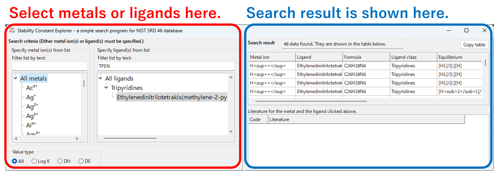

# Stability Constants Explorer
## Overview
Stability Constants Explorer is a simple search program for [NIST SRD 46 database, "Critically Selected Stability Constants of Metal Complexes"](https://data.nist.gov/od/id/mds2-2154). This database is very useful for chemists, but unfortunately it has been discontinued and the official search program does not work on modern PCs. Therefore, I have created a simple search program based on the data available on the NIST website.

## Download
For Microsoft Windows 7 or later (64 bit), download [StabilityConstantsExplorer_Win64.zip](https://github.com/n-hatada/stability-constants-explorer/releases/download/v1.0/StabilityConstantsExplorer_Win64.zip).

## Install

### On Microsoft Windows 7 or later (64 bit)
Unzip the downloaded compressed file to an appropriate folder. The compressed file contains the following files:
* Executable program (StabilityConstantsExplorer.exe)
* SQLite3 database engine (sqlite3.dll)
* Stability constants adatabase (NIST_SRD_46_ported.db)
* documentation (Readme_Win64.txt)

### On other operating systems
Compile the source code using [Lazarus](https://www.lazarus-ide.org/). Obtain and install an appropriate [SQLite3](https://www.sqlite.org/index.html) engine. Place the database file (NIST_SRD_46_ported.db) in the same folder as the compiled program.

## Usage
Execute the program. On the left side of the window, specify the search criteria for stability constants (metal ions and ligands). The search results are displayed on the right side.

## Author
Naoyuki Hatada, Ph.D.
Department of Materials Science and Engineering, Kyoto University

## Data source
The accompanying database file (NIST_SRD_46_ported.db) is based on the following dataset which is distributed at the NIST website:

* Donald R. Burgess (2004), NIST SRD 46. Critically Selected Stability Constants of Metal Complexes: Version 8.0 for Windows, National Institute of Standards and Technology, https://doi.org/10.18434/M32154 (Accessed June 25, 2021)

The author (Naoyuki Hatada) downloaded the dataset (SRD 46 SQL.zip) from the above website and converted to the SQLite3 format. The dataset may contain errors described in "SRD 46 README.txt" on the website or those caused by the conversion process. 

## License
The database file (NIST_SRD_46_ported.db) is a derivative work of the data distributed by NIST. See the [NIST website](https://doi.org/10.18434/M32154) for usage guidelines. The SQLite3 engine (sqlite3.dll) included in the compressed file (StabilityConstantsExplorer_Win64.zip) is in the public domain. The other files (source code and the executable program) are released into the public domain by the author. 
